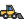

# Construction-Company-Website 
Personal project 2020  
Responsive website as an exercise after learning SASS preprocessor  
The primary focus of the project was on the design of the user interface and the application of newly acquired knowledge 
Inside Project folder you can find images of UI and/or project documentation.

## Built With
* HTML5
* Sass (Variables, Nesting, Modules, Mixins..)
* JavaScript
